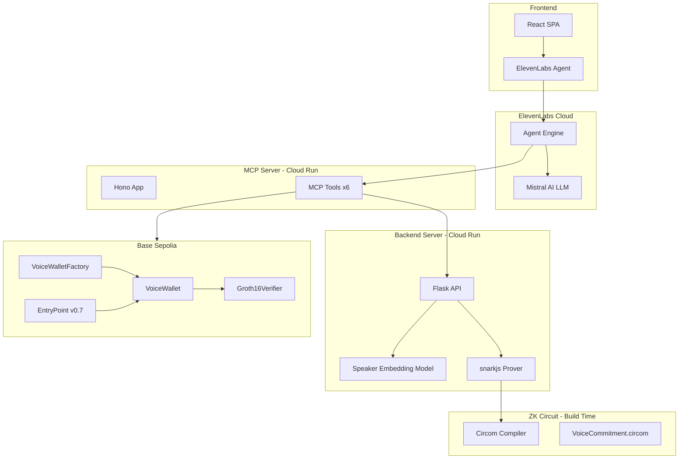
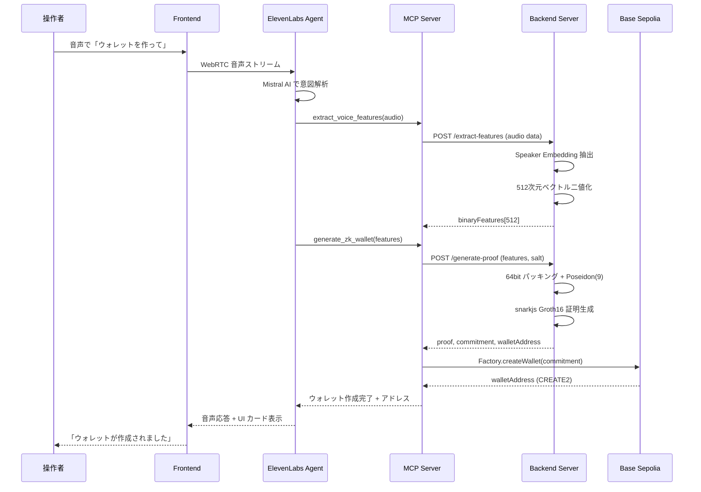
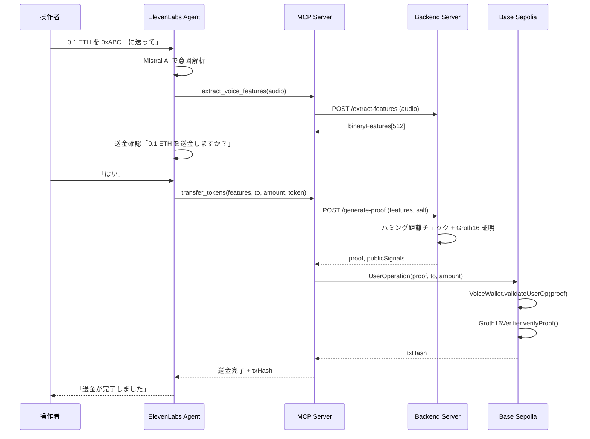
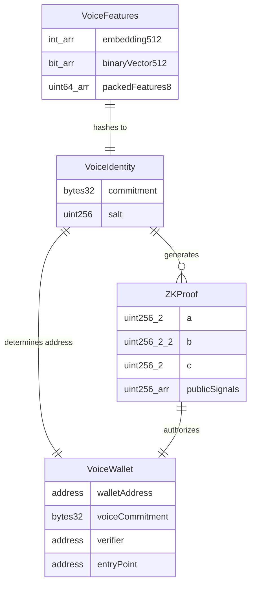

# Design Document: Voice ZK Wallet

## Overview

**Purpose**: 本機能は、操作者の声の特徴量をゼロ知識証明で秘匿化し、決定論的に ERC-4337 スマートウォレットを生成・操作する音声 AI エージェント決済システムを実現する。

**Users**: 暗号資産操作に不慣れなユーザーが、音声会話のみでウォレット作成・残高確認・送金を完結する。

**Impact**: 声がデジタルアイデンティティの「鍵」となり、秘密鍵の管理不要で ERC-4337 ウォレットを操作可能にする。

### Goals
- 声の特徴量から決定論的にウォレットアドレスを導出し、ZK 証明で所有権を検証
- ElevenLabs + Mistral AI による自然な日本語音声会話での全ウォレット操作
- 声の生データ・特徴量をオンチェーンに一切保存しないプライバシー保護

### Non-Goals
- BCH 誤り訂正符号の完全な Circom 実装（ハミング距離閾値チェックで代替）
- 本番環境レベルのセキュリティ監査（ハッカソンプロトタイプ）
- マルチチェーン対応（Base Sepolia のみ）
- フィアット通貨との交換機能

## Architecture

### Architecture Pattern & Boundary Map



**Architecture Integration**:
- **Selected pattern**: 
  - モノレポ分離型 — 5 パッケージで責務を分離し、REST API で通信
- **Domain/feature boundaries**: 
  - Frontend（UI/音声）
  - MCP Server（ツールオーケストレーション）
  - Backend（声処理/ZK証明）
  - Contract（オンチェーンロジック）
  - Circuit（ZK回路）
- **Existing patterns preserved**: 
  - pnpm workspace
  - Groth16 パイプライン
  - ElevenLabs SDK 統合
- **New components rationale**: 
  - Backend は Python ML モデル統合のため新規
  - MCP Tools は ElevenLabs Agent のツール呼び出しハブとして必須
- **Steering compliance**: 
  - tech.md のスタック選定
  - structure.md のモノレポ構成に準拠

### Technology Stack

| Layer | Choice / Version | Role in Feature | Notes |
|-------|------------------|-----------------|-------|
| Frontend | React 19 + Vite 7 + TypeScript 5.9 | 音声 AI エージェント UI | Tailwind CSS + shadcn/ui + Framer Motion 追加 |
| Voice AI | @elevenlabs/react 0.14 + Mistral AI (Custom LLM) | リアルタイム音声会話 + MCP ツール呼び出し | ElevenLabs ダッシュボードで Agent 設定 |
| MCP Server | Hono 4.12 + @hono/mcp + @modelcontextprotocol/sdk | 6 ツールのエンドポイント | Streamable HTTP トランスポート |
| Backend | Python 3.11 + Flask + pyannote-audio 3.1 + snarkjs | 声の特徴量抽出 + ZK 証明生成 | Docker コンテナ / Cloud Run |
| Smart Contract | Solidity 0.8.28 + @account-abstraction/contracts 0.7 + @openzeppelin/contracts 5.0 | ERC-4337 ウォレット + ZK 検証 | Base Sepolia |
| ZK Circuit | Circom 2.0 + snarkjs 0.6.9 + circomlib 2.0.5 | 声のコミットメント + 所有権証明 | Groth16 証明スキーム |
| Infrastructure | Cloud Run (Backend, MCP Server) + Vercel (Frontend) | デプロイ基盤 | 同一リージョン配置 |

## System Flows

### 声の登録とウォレット生成フロー



### 声の認証と送金フロー



## Requirements Traceability

| Requirement | Summary | Components | Interfaces | Flows |
|-------------|---------|------------|------------|-------|
| 1.1 | 音声から話者埋め込み抽出 | BackendServer | POST /extract-features | 登録フロー |
| 1.2 | 特徴量の二値化 | BackendServer | POST /extract-features | 登録フロー |
| 1.3 | 同一話者のハミング距離保証 | BackendServer, VoiceCommitment | POST /extract-features | 認証フロー |
| 1.4 | HuggingFace モデル使用 | BackendServer | — | — |
| 1.5 | 品質不足時エラー返却 | BackendServer | POST /extract-features (400) | — |
| 2.1 | Poseidon コミットメント生成 | VoiceCommitment 回路 | — | 登録フロー |
| 2.2 | Fuzzy Commitment（ハミング距離閾値） | VoiceOwnership 回路 | — | 認証フロー |
| 2.3 | コミットメントの不可逆性 | VoiceCommitment 回路 | — | — |
| 2.4 | Groth16 所有権証明 | VoiceOwnership 回路, BackendServer | POST /generate-proof | 認証フロー |
| 2.5 | snarkjs 証明生成 | BackendServer | POST /generate-proof | 認証フロー |
| 3.1 | 決定論的ウォレットアドレス | VoiceWalletFactory | createWallet() | 登録フロー |
| 3.2 | ERC-4337 UserOperation 処理 | VoiceWallet | validateUserOp() | 送金フロー |
| 3.3 | Base Sepolia デプロイ | VoiceWallet, Factory, Verifier | — | — |
| 3.4 | 同一コミットメント → 同一アドレス | VoiceWalletFactory | getAddress() | 登録フロー |
| 3.5 | ZK Proof 必須のウォレット操作 | VoiceWallet | validateUserOp() | 送金フロー |
| 4.1 | ETH 残高取得 | MCPServer get_wallet_balance | MCP Tool | — |
| 4.2 | USDC 残高取得 | MCPServer get_wallet_balance | MCP Tool | — |
| 4.3 | フレンドリーな残高表示 | MCPServer get_wallet_balance | MCP Tool | — |
| 4.4 | ウォレット未作成通知 | MCPServer get_wallet_balance | MCP Tool (404) | — |
| 5.1 | ウォレットアドレス返却 | MCPServer get_wallet_address | MCP Tool | — |
| 5.2 | QR コード表示 | Frontend QRCodeCard | — | — |
| 5.3 | EIP-681 ペイメントリンク | Frontend QRCodeCard | — | — |
| 5.4 | チェックサム形式アドレス | MCPServer get_wallet_address | MCP Tool | — |
| 6.1 | ETH 送金実行 | MCPServer transfer_tokens | MCP Tool | 送金フロー |
| 6.2 | USDC 送金実行 | MCPServer transfer_tokens | MCP Tool | 送金フロー |
| 6.3 | トランザクション状況表示 | Frontend TransactionCard | — | 送金フロー |
| 6.4 | txHash 返却 | MCPServer transfer_tokens | MCP Tool | 送金フロー |
| 6.5 | 残高不足エラー | MCPServer transfer_tokens | MCP Tool (400) | — |
| 6.6 | 送金前の音声二重確認 | ElevenLabs Agent | — | 送金フロー |
| 7.1 | MCP 準拠インターフェース | MCPServer | Streamable HTTP | — |
| 7.2 | 6 ツール実装 | MCPServer | MCP Tools | — |
| 7.3 | Hono + TypeScript | MCPServer | — | — |
| 7.4 | MCP Inspector 対応 | MCPServer | — | — |
| 7.5 | 構造化エラーレスポンス | MCPServer | MCP Error | — |
| 8.1 | ElevenLabs 音声会話 UI | Frontend VoiceOrb | — | — |
| 8.2 | WebRTC 低遅延通信 | Frontend | useConversation() | — |
| 8.3 | リアルタイムテキスト表示 | Frontend MessageLog | — | — |
| 8.4 | 音声 + テキスト応答 | Frontend MessageLog | — | — |
| 8.5 | 接続・発話状態表示 | Frontend StatusBar | — | — |
| 8.6 | Mistral AI LLM | ElevenLabs Agent Config | Custom LLM | — |
| 9.1 | React + Vite + Tailwind + shadcn | Frontend | — | — |
| 9.2 | カスタムデザイン原則 | Frontend | — | — |
| 9.3 | 音声ビジュアルフィードバック | Frontend VoiceOrb | — | — |
| 9.4 | リッチカード UI | Frontend WalletCard, TransactionCard | — | — |
| 9.5 | PWA 対応 | Frontend | — | — |
| 9.6 | レスポンシブデザイン | Frontend | — | — |
| 10.1 | Flask API + Cloud Run | BackendServer | REST API | — |
| 10.2 | Docker コンテナ | BackendServer | Dockerfile | — |
| 10.3 | REST API + .http テスト | BackendServer | — | — |
| 10.4 | 話者埋め込みモデル統合 | BackendServer | POST /extract-features | — |
| 10.5 | snarkjs Groth16 生成 | BackendServer | POST /generate-proof | — |
| 10.6 | 声データ非永続化 | BackendServer | — | — |
| 11.1 | 声データのオンチェーン非保存 | System-wide | — | — |
| 11.2 | コミットメントのみオンチェーン | VoiceWalletFactory | — | — |
| 11.3 | メモリ上処理 + 破棄 | BackendServer | — | — |
| 11.4 | ZK Proof 必須のウォレット操作 | VoiceWallet | validateUserOp() | — |
| 11.5 | 送金前音声確認 | ElevenLabs Agent | — | 送金フロー |
| 11.6 | ZK Proof 検証失敗時 revert | VoiceWallet, Groth16Verifier | — | — |

## Components and Interfaces

| Component | Domain/Layer | Intent | Req Coverage | Key Dependencies | Contracts |
|-----------|-------------|--------|--------------|------------------|-----------|
| VoiceCommitment 回路 | ZK Circuit | 声の特徴量から Poseidon コミットメント生成 | 2.1, 2.3 | circomlib Poseidon (P0) | — |
| VoiceOwnership 回路 | ZK Circuit | ハミング距離閾値チェック + 所有権証明 | 2.2, 2.4 | VoiceCommitment (P0) | — |
| VoiceWallet | Smart Contract | ERC-4337 ウォレット + ZK 検証 | 3.1, 3.2, 3.5, 11.4, 11.6 | Groth16Verifier (P0), EntryPoint (P0) | Service |
| VoiceWalletFactory | Smart Contract | 決定論的ウォレット生成 | 3.1, 3.4, 11.2 | VoiceWallet (P0) | Service |
| Groth16Verifier | Smart Contract | ZK Proof のオンチェーン検証 | 2.4, 11.6 | snarkjs 自動生成 (P0) | Service |
| BackendServer | Backend | 声の特徴量抽出 + ZK 証明生成 | 1.1-1.5, 2.5, 10.1-10.6, 11.3 | pyannote-audio (P0), snarkjs (P0) | API |
| MCPServer | MCP Server | 6 ツールの MCP エンドポイント | 4.1-4.4, 5.1, 5.4, 6.1-6.6, 7.1-7.5 | BackendServer (P0), viem (P0) | API |
| Frontend App | Frontend | 音声 AI エージェント UI | 8.1-8.6, 9.1-9.6, 5.2, 5.3, 6.3 | ElevenLabs SDK (P0), React (P0) | State |

### ZK Circuit Layer

#### VoiceCommitment 回路

| Field | Detail |
|-------|--------|
| Intent | 声の二値化特徴量ベクトルを 64ビットパッキングし、Poseidon(9) でコミットメントを生成 |
| Requirements | 2.1, 2.3 |

**Responsibilities & Constraints**
- 512ビットの二値化特徴量を 8 つの 64ビットフィールド要素にパッキング
- salt とともに Poseidon(9) でハッシュしてコミットメントを算出
- コミットメントから元の特徴量を逆算不可能（Poseidon の一方向性に依存）

**Dependencies**
- External: circomlib/poseidon.circom — Poseidon ハッシュ関数 (P0)

**Contracts**: Service [x]

##### Service Interface

```circom
template VoiceCommitment() {
    signal input voiceFeatures[8];  // 64bit-packed binary features
    signal input salt;
    signal output commitment;
    // Poseidon(9) hash of [voiceFeatures[0..7], salt]
}
```
- Preconditions: 各 voiceFeatures[i] は 64ビット以内の値
- Postconditions: commitment = Poseidon(voiceFeatures[0], ..., voiceFeatures[7], salt)
- Invariants: 同一入力から常に同一出力

#### VoiceOwnership 回路

| Field | Detail |
|-------|--------|
| Intent | 声の所有権をハミング距離閾値チェック + コミットメント一致で ZK 証明 |
| Requirements | 2.2, 2.4 |

**Responsibilities & Constraints**
- 登録時特徴量（リファレンス）と認証時特徴量の XOR → ポップカウント → 閾値比較
- コミットメント一致検証（リファレンス特徴量 + salt → Poseidon → publicCommitment と比較）
- ハミング距離閾値はコンパイル時パラメータ（初期値: 128 / 512 = 25%）

**Dependencies**
- Inbound: VoiceCommitment — コミットメント計算 (P0)

**Contracts**: Service [x]

##### Service Interface

```circom
template VoiceOwnership(hammingThreshold) {
    // Private inputs
    signal input referenceFeatures[8];   // 登録時の 64bit-packed features
    signal input currentFeatures[8];     // 認証時の 64bit-packed features
    signal input salt;

    // Public inputs
    signal input publicCommitment;

    // 1. Hamming distance check: popcount(XOR(ref, cur)) <= hammingThreshold
    // 2. Commitment check: Poseidon(ref, salt) == publicCommitment
}
```
- Preconditions: referenceFeatures は登録時の特徴量、currentFeatures は認証時の特徴量
- Postconditions: 証明が生成された場合、ハミング距離が閾値以下かつコミットメントが一致
- Invariants: hammingThreshold はコンパイル時固定

**Implementation Notes**
- XOR は Circom のビット演算で実装。各ビットを分解して XOR → Sum でポップカウント
- ポップカウント結果を LessThan コンポーネントで閾値と比較
- 回路制約数の見積もり: 約 512 (XOR) + 512 (popcount) + 1 (threshold) + Poseidon(9) ≈ 2,000-3,000 制約

### Smart Contract Layer

#### VoiceWallet

| Field | Detail |
|-------|--------|
| Intent | ZK Proof 検証付き ERC-4337 スマートウォレット |
| Requirements | 3.1, 3.2, 3.5, 11.4, 11.6 |

**Responsibilities & Constraints**
- SimpleAccount (ERC-4337 v0.7) を拡張
- validateUserOp で ZK Proof を検証（Groth16Verifier に委譲）
- 初期化時に voiceCommitment（公開コミットメント）を登録
- ETH / ERC-20 の送金実行

**Dependencies**
- Inbound: EntryPoint v0.7.0 — UserOperation 処理 (P0)
- Inbound: VoiceWalletFactory — ウォレット生成 (P0)
- Outbound: Groth16Verifier — ZK Proof 検証 (P0)

**Contracts**: Service [x]

##### Service Interface

```solidity
interface IVoiceWallet {
    function initialize(
        address entryPoint,
        address verifier,
        uint256 voiceCommitment
    ) external;

    function executeFromEntryPoint(
        address dest,
        uint256 value,
        bytes calldata func
    ) external;

    // Inherited from BaseAccount
    function validateUserOp(
        PackedUserOperation calldata userOp,
        bytes32 userOpHash,
        uint256 missingAccountFunds
    ) external returns (uint256 validationData);
}
```
- Preconditions: validateUserOp の userOp.signature に ZK Proof データを含む
- Postconditions: Proof 検証成功時のみ操作実行。失敗時は revert
- Invariants: voiceCommitment は初期化後変更不可

#### VoiceWalletFactory

| Field | Detail |
|-------|--------|
| Intent | 声のコミットメントから決定論的にウォレットアドレスを生成 |
| Requirements | 3.1, 3.4, 11.2 |

**Responsibilities & Constraints**
- CREATE2 + commitment をソルトに使用して決定論的アドレス算出
- ウォレット未作成時はアドレス計算のみ（counterfactual deployment）
- 初回 UserOperation 実行時に initCode で自動デプロイ

**Dependencies**
- Outbound: VoiceWallet — ウォレットインスタンス生成 (P0)
- External: EntryPoint v0.7.0 — `0x0000000071727De22E5E9d8BAf0edAc6f37da032` (P0)

**Contracts**: Service [x]

##### Service Interface

```solidity
interface IVoiceWalletFactory {
    function createWallet(
        address entryPoint,
        address verifier,
        uint256 voiceCommitment,
        uint256 salt
    ) external returns (address wallet);

    function getAddress(
        address entryPoint,
        address verifier,
        uint256 voiceCommitment,
        uint256 salt
    ) external view returns (address);
}
```
- Preconditions: entryPoint と verifier は有効なコントラクトアドレス
- Postconditions: 同一入力から常に同一アドレスを返却
- Invariants: CREATE2 の決定論性

#### Groth16Verifier

| Field | Detail |
|-------|--------|
| Intent | snarkjs で自動生成された Groth16 証明検証コントラクト |
| Requirements | 2.4, 11.6 |

**Responsibilities & Constraints**
- executeGroth16.sh で自動生成される Solidity コントラクト
- verifyProof(a, b, c, publicSignals) で証明を検証
- VoiceWallet から呼び出される

**Dependencies**
- External: snarkjs 自動生成 — executeGroth16.sh パイプライン (P0)

**Contracts**: Service [x]

##### Service Interface

```solidity
interface IGroth16Verifier {
    function verifyProof(
        uint256[2] calldata a,
        uint256[2][2] calldata b,
        uint256[2] calldata c,
        uint256[1] calldata publicSignals  // [publicCommitment]
    ) external view returns (bool);
}
```
- Preconditions: 引数は snarkjs が出力する calldata 形式
- Postconditions: 有効な証明なら true、無効なら false
- Invariants: 検証ロジックは状態を変更しない（view）

### Backend Layer

#### BackendServer

| Field | Detail |
|-------|--------|
| Intent | 声の特徴量抽出と ZK 証明生成を行う Python REST API |
| Requirements | 1.1-1.5, 2.5, 10.1-10.6, 11.3 |

**Responsibilities & Constraints**
- pyannote-audio（または wespeaker）で 512次元の話者埋め込みを抽出
- 埋め込みベクトルを閾値二値化し、512ビットのバイナリベクトルに変換
- 64ビットパッキングして 8 フィールド要素に変換
- snarkjs (Node.js subprocess) で Groth16 証明を生成
- 音声データ・特徴量はメモリ上のみで処理、レスポンス返却後に破棄
- Docker コンテナとしてパッケージ化

**Dependencies**
- External: pyannote-audio 3.1 / wespeaker — 話者埋め込みモデル (P0)
- External: snarkjs 0.6.9 — ZK 証明生成 (P0)
- External: `mistral-hackaton-2026` HuggingFace モデル — 第一候補。利用不可時は pyannote フォールバック (P1)

**Contracts**: API [x]

##### API Contract

| Method | Endpoint | Request | Response | Errors |
|--------|----------|---------|----------|--------|
| POST | /extract-features | `{ audio: base64 }` | `{ features: number[], binaryFeatures: number[] }` | 400 (品質不足), 500 |
| POST | /generate-proof | `{ referenceFeatures: number[], currentFeatures: number[], salt: string }` | `{ proof: object, publicSignals: string[], commitment: string }` | 400 (ハミング距離超過), 500 |
| POST | /generate-commitment | `{ features: number[], salt: string }` | `{ commitment: string, packedFeatures: string[] }` | 400, 500 |
| GET | /health | — | `{ status: "ok" }` | 500 |

**Implementation Notes**
- Integration: Node.js subprocess で snarkjs CLI を呼び出し。Python ↔ Node.js は一時ファイル (input.json) 経由
- Validation: 音声データの長さ・フォーマット（WAV/WebM）をバリデーション。最低 1 秒以上を要求
- Risks: ML モデルのロード時間（コールドスタート 10-30 秒）。Cloud Run の min-instances=1 で軽減

### MCP Server Layer

#### MCPServer

| Field | Detail |
|-------|--------|
| Intent | ElevenLabs Agent のツール呼び出しハブ。6 つの MCP ツールを提供 |
| Requirements | 4.1-4.4, 5.1, 5.4, 6.1-6.6, 7.1-7.5 |

**Responsibilities & Constraints**
- Model Context Protocol に準拠した Streamable HTTP エンドポイント
- Hono + @hono/mcp + @modelcontextprotocol/sdk で構築
- BackendServer への HTTP 呼び出しで声処理・証明生成を委譲
- viem で Base Sepolia と通信（残高取得・トランザクション送信）
- 構造化エラーレスポンスの返却

**Dependencies**
- Outbound: BackendServer — 声の特徴量抽出・ZK 証明生成 (P0)
- External: viem — Base Sepolia RPC 通信 (P0)
- External: @hono/mcp — MCP Streamable HTTP トランスポート (P0)

**Contracts**: API [x]

##### MCP Tool Definitions

| Tool Name | Description | Input Schema | Output | Req |
|-----------|-------------|--------------|--------|-----|
| extract_voice_features | 音声データから特徴量を抽出 | `{ audio: string (base64) }` | `{ features: number[], binaryFeatures: number[] }` | 1.1-1.5 |
| generate_zk_wallet | ZK 証明生成 + ウォレットアドレス算出 | `{ features: number[], salt?: string }` | `{ walletAddress: string, commitment: string, proof: object }` | 2.1-2.5, 3.1, 3.4 |
| get_wallet_balance | ウォレット残高取得 | `{ walletAddress: string }` | `{ eth: string, usdc: string }` | 4.1-4.4 |
| get_wallet_address | ウォレットアドレス取得 | `{ commitment: string }` | `{ address: string }` | 5.1, 5.4 |
| show_wallet_qrcode | QR コード表示指示 | `{ walletAddress: string }` | `{ qrDataUrl: string, eip681Uri: string }` | 5.2, 5.3 |
| transfer_tokens | トークン送金実行 | `{ from: string, to: string, amount: string, token: "ETH" \| "USDC", proof: object }` | `{ txHash: string, status: string }` | 6.1-6.6 |

**Implementation Notes**
- Integration: ツールは `tools/` ディレクトリにモジュール分離。各ツールは独立ファイル
- Validation: 入力スキーマは Zod で定義。MCP SDK のスキーマバリデーションと連携
- Risks: BackendServer 通信のレイテンシ。タイムアウト設定（30秒）と適切なエラーハンドリング

### Frontend Layer

#### Frontend App

| Field | Detail |
|-------|--------|
| Intent | ElevenLabs 音声 AI エージェントとの対話 UI + ウォレット操作の可視化 |
| Requirements | 8.1-8.6, 9.1-9.6, 5.2, 5.3, 6.3 |

**Responsibilities & Constraints**
- ElevenLabs SDK (useConversation) によるリアルタイム音声通信
- 音声会話のビジュアルフィードバック（VoiceOrb コンポーネント）
- ウォレット操作結果のリッチカード表示
- Tailwind CSS + shadcn/ui + Framer Motion によるカスタムデザイン
- PWA + レスポンシブ対応

**Dependencies**
- External: @elevenlabs/react 0.14 — 音声通信 SDK (P0)
- External: Tailwind CSS 4 + shadcn/ui — UI フレームワーク (P0)
- External: Framer Motion — アニメーション (P1)
- External: qrcode.react — QR コード生成 (P1)

**Contracts**: State [x]

##### State Management

```typescript
interface AppState {
  // Connection
  connectionStatus: "disconnected" | "connecting" | "connected";
  agentStatus: "idle" | "listening" | "speaking" | "thinking";

  // Conversation
  messages: Message[];
  conversationId: string | null;

  // Wallet
  walletAddress: string | null;
  commitment: string | null;
  ethBalance: string | null;
  usdcBalance: string | null;

  // Transaction
  pendingTx: PendingTransaction | null;
  txHistory: Transaction[];

  // UI
  showQRCode: boolean;
  activeCard: "balance" | "address" | "transaction" | null;
}

interface Message {
  role: "user" | "agent" | "system";
  content: string;
  timestamp: number;
  toolResult?: ToolResultCard;
}

interface ToolResultCard {
  type: "balance" | "address" | "qrcode" | "transaction" | "error";
  data: Record<string, unknown>;
}

interface PendingTransaction {
  to: string;
  amount: string;
  token: "ETH" | "USDC";
  status: "confirming" | "submitting" | "pending" | "confirmed" | "failed";
  txHash?: string;
}

interface Transaction {
  txHash: string;
  to: string;
  amount: string;
  token: "ETH" | "USDC";
  status: "confirmed" | "failed";
  timestamp: number;
}
```

- State model: React useState + useReducer で管理（外部状態管理ライブラリ不使用）
- Persistence: セッション中のみ（リロードでリセット）
- Concurrency: ElevenLabs SDK のコールバックで状態更新

##### UI Component Structure

| Component | Responsibility | Req |
|-----------|---------------|-----|
| VoiceOrb | 音声会話のビジュアルフィードバック。接続状態・発話状態に応じた波形/パルスアニメーション | 8.5, 9.3 |
| MessageLog | 会話履歴のリアルタイム表示。ToolResultCard の inline 表示 | 8.3, 8.4 |
| WalletCard | 残高・アドレスのカード表示 | 9.4 |
| QRCodeCard | EIP-681 ペイメントリンク付き QR コード | 5.2, 5.3 |
| TransactionCard | トランザクション状況のリアルタイム表示 | 6.3, 9.4 |
| StatusBar | 接続状態バッジ | 8.5 |

**Implementation Notes**
- Integration: 既存 App.tsx の ElevenLabs 統合を活用しつつコンポーネント分離
- Validation: ElevenLabs SDK のコールバックでエラーハンドリング
- Risks: WebRTC 接続の不安定さ。fallback として WebSocket モードを提供（既存実装済み）

## Data Models

### Domain Model



**Aggregates and Transactional Boundaries**
- VoiceIdentity: commitment + salt のペア。オフチェーンで管理（Backend セッション内のみ）
- VoiceWallet: オンチェーン。commitment の登録は Factory 経由で一度のみ
- ZKProof: 使い捨て。各 UserOperation に付与

**Business Rules & Invariants**
- 同一 commitment → 同一 walletAddress（CREATE2 の決定論性）
- VoiceWallet の操作には有効な ZKProof が必須
- 声の生データ・特徴量はオンチェーンに保存しない

### Data Contracts & Integration

**API Data Transfer**
- Backend ↔ MCP Server: JSON over HTTP。Base64 エンコードの音声データ、数値配列の特徴量
- MCP Server ↔ Blockchain: viem による ABI エンコード/デコード
- Frontend ↔ ElevenLabs: WebRTC/WebSocket バイナリストリーム

**Serialization Format**: JSON（全 REST API）

## Error Handling

### Error Strategy
各レイヤーで発生しうるエラーを分類し、ユーザーに対して音声で自然なフィードバックを返す。

### Error Categories and Responses

**User Errors (4xx)**:
- 音声品質不足 → 「もう少しはっきりと話してください」（Backend 400）
- 残高不足 → 「残高が足りません。現在の残高は X ETH です」（MCP Server 400）
- ウォレット未作成 → 「まずウォレットを作成しましょう」（MCP Server 404）
- 無効なアドレス → 「送金先アドレスが正しくありません」（MCP Server 400）

**System Errors (5xx)**:
- Backend 通信エラー → 「処理中にエラーが発生しました。もう一度お試しください」
- Blockchain トランザクション失敗 → 「トランザクションが失敗しました」+ revert 理由
- ZK Proof 生成失敗 → 「認証に失敗しました。もう一度声を聞かせてください」

**Business Logic Errors (422)**:
- ハミング距離超過 → 「声の認証に失敗しました。登録時と同じように話してください」
- ZK Proof 検証失敗 → コントラクトが revert

### Monitoring
- Backend: Flask logger + Cloud Run ログ
- MCP Server: Hono middleware でリクエスト/レスポンスログ
- Frontend: console.error + ElevenLabs SDK エラーコールバック

## Testing Strategy

### Unit Tests
- VoiceCommitment 回路: 正しい Poseidon コミットメント生成の検証（circom_tester）
- VoiceOwnership 回路: ハミング距離閾値の境界値テスト
- VoiceWallet コントラクト: validateUserOp の ZK Proof 検証ロジック（Hardhat test）
- Backend: 二値化ロジック、パッキングロジックのユニットテスト（pytest）

### Integration Tests
- Backend → snarkjs: 特徴量入力から証明生成までのパイプライン
- MCP Server → Backend: ツール呼び出しからレスポンスまでの E2E
- Factory → Wallet → Verifier: デプロイから UserOperation 実行までのオンチェーンフロー

### E2E Tests
- 音声入力 → 特徴量抽出 → ウォレット生成 → 残高確認のフルフロー
- 送金フローの音声確認 → トランザクション実行 → 結果表示

## Security Considerations

- **声データの秘匿**: 声の生音声・特徴量ベクトルはオンチェーンに一切保存しない。Backend でメモリ上処理後に破棄（11.1, 11.2, 11.3）
- **ZK Proof 検証**: ウォレットの状態変更操作は全て Groth16 証明の検証を必須とする（11.4, 11.6）
- **送金の二重確認**: ElevenLabs Agent の会話フローで送金前に金額・送金先を音声確認（11.5）
- **コントラクトセキュリティ**: ハッカソンプロトタイプのため本番監査は対象外。reentrancy guard は OpenZeppelin の標準実装を使用
- **API セキュリティ**: Backend と MCP Server 間は Cloud Run の内部通信。外部からは ElevenLabs Agent 経由のみアクセス

## Performance & Scalability

- **ZK 証明生成**: Groth16 証明生成は 2-10 秒（回路制約数に依存）。ptau-14 を使用
- **コールドスタート**: Backend の ML モデルロードに 10-30 秒。Cloud Run min-instances=1 で軽減
- **音声レイテンシ**: ElevenLabs WebRTC で 200ms 以下を目標
- **ブロックチェーン**: Base Sepolia は 2 秒ブロックタイム。トランザクション確認は 1-2 ブロック

## Supporting References

`research.md` に詳細な調査ログ・代替案評価・リスク分析を記載。主要な結論は本ドキュメント内で完結。
