# Mistral-Worldwide-Hackathon

Repository for Mistral Worldwide Hackathon. https://luma.com/mistralhack-tokyo?tk=y0lkUf

## Live Demo

https://mistral-worldwide-hackathon-fronten.vercel.app

## Overview

A privacy-preserving system for operating blockchain wallets using your voice.

Voice features are committed via zero-knowledge proofs (ZK-SNARK / Groth16), enabling identity verification without ever exposing raw voiceprints on-chain.

The system deterministically generates ERC-4337 Account Abstraction-compliant smart wallets, allowing users to check balances, send tokens, and receive payments entirely through voice conversations with an AI agent (ElevenLabs).

## Background

Traditional wallets require complex private key management, making UX a major barrier to Web3 adoption. While conventional payment methods still dominate the human economy, the emergence of platforms like OpenClaw and Moltbook is rapidly increasing the volume of stablecoin payments within the AI Agent economy.

We expect this trend to drive growing demand for stablecoin payments conducted through AI interactions.

However, as noted above, Web3 wallet UX has many challenges that make immediate onboarding difficult — let alone providing a UX designed for interactions with AI agents.

At this hackathon, we built a product to solve this problem.

This project combines voice — the ultimate biometric — with zero-knowledge proofs, enabling a future where users can safely manage their assets simply by talking to an AI, all while preserving privacy.

## Key Challenges

First, designing and developing the ZK circuit to keep voice features private was a major challenge.

Connecting the backend server — which extracts features from audio using a Hugging Face model and generates ZK proofs — was also difficult.

For the connection between the backend and the blockchain, we prepared a Verifier contract for zero-knowledge proofs, enabling wallet generation directly from voice data.

Finally, turning all of these features into an MCP server and fine-tuning the integration so that the AI agent can invoke them via the ElevenLabs SDK was extremely challenging.

However, as a result, we completed a product where everything can be done through voice interaction!

## System Architecture

### Overall Structure

```mermaid
graph TB
    subgraph User["👤 User"]
        Voice["🎙️ Voice Input"]
    end

    subgraph Frontend["Frontend<br/>(React 19 + Vite)"]
        UI["Voice Chat UI"]
        EL["ElevenLabs SDK<br/>(WebRTC / WebSocket)"]
        VoiceOrb["Voice Orb<br/>Animation"]
    end

    subgraph ElevenLabsAgent["ElevenLabs<br/>AI Agent"]
        Agent["Conversation Engine +<br/>MCP Tool Invocation"]
    end

    subgraph MCPServer["MCP Server<br/>(Hono + TypeScript)"]
        MCP["MCP Streamable HTTP<br/>/mcp Endpoint"]
        Tools["8 MCP Tools"]
    end

    subgraph Backend["Backend<br/>(Flask + Python)"]
        FE["Voice Feature Extraction<br/>(pyannote)"]
        ZKProof["ZK Proof Generation<br/>(snarkjs / Groth16)"]
    end

    subgraph Blockchain["Base Sepolia"]
        EP["EntryPoint<br/>(ERC-4337 v0.7)"]
        Factory["VoiceWalletFactory<br/>(CREATE2)"]
        Wallet["VoiceWallet<br/>(ERC-4337 Account)"]
        Verifier["VoiceOwnershipVerifier<br/>(Groth16)"]
        USDC["MockERC20<br/>(USDC)"]
    end

    subgraph ZKCircuit["ZK Circuit<br/>(Circom 2.0)"]
        VC["VoiceCommitment<br/>(Poseidon Hash)"]
        VO["VoiceOwnership<br/>(Hamming Distance)"]
    end

    Voice --> UI
    UI --> EL
    EL <-->|Audio Stream| Agent
    Agent -->|Tool Call| MCP
    MCP --> Tools
    Tools -->|REST API| FE
    Tools -->|REST API| ZKProof
    Tools -->|RPC / Tx| EP
    Tools -->|Read| Factory
    FE -.->|Features| ZKProof
    ZKProof -.->|Circuit Execution| VC
    ZKProof -.->|Circuit Execution| VO
    EP --> Wallet
    Factory -->|Proxy Deploy| Wallet
    Wallet -->|Proof Verification| Verifier
    Wallet -->|Transfer| USDC
```



### Package Structure

```
Mistral-Worldwide-Hackathon/
├── pkgs/
│   ├── frontend/    # React 19 + Vite — Voice chat UI (ElevenLabs)
│   ├── mcpserver/   # Hono — MCP server (8 Tools)
│   ├── backend/     # Flask — Voice feature extraction & ZK proof generation
│   ├── contract/    # Hardhat — VoiceWallet (ERC-4337) & Verifier
│   └── circuit/     # Circom 2.0 — VoiceCommitment & VoiceOwnership circuits
└── pnpm-workspace.yaml
```

## Feature List

| # | Feature | Description | MCP Tool | Related Packages |
|---|---------|-------------|----------|-----------------|
| 1 | Voice Feature Extraction | Extracts a 512-dimensional speaker embedding from audio and packs it into 8 x 64-bit integers | `extract_voice_features` | backend, mcpserver |
| 2 | ZK Wallet Generation | Computes a Poseidon commitment from voice features and deterministically derives a wallet address | `generate_zk_wallet` | backend, mcpserver, contract |
| 3 | Wallet Deployment | Deploys an ERC-4337 compliant VoiceWallet proxy on-chain via Factory | `create_wallet` | mcpserver, contract |
| 4 | ZK Proof Generation | Compares enrolled and current voice features, generates a Groth16 proof if Hamming distance ≤ 128 | `generate_zk_proof` | backend, mcpserver, circuit |
| 5 | Balance Inquiry | Retrieves and displays the wallet's ETH / USDC balance | `get_wallet_balance` | mcpserver |
| 6 | Wallet Address Lookup | Deterministically computes a wallet address from a commitment value | `get_wallet_address` | mcpserver, contract |
| 7 | QR Code Display | Generates EIP-681 payment link QR code data | `show_wallet_qrcode` | mcpserver, frontend |
| 8 | Token Transfer | Sends ETH / USDC via a UserOperation with a ZK proof | `transfer_tokens` | mcpserver, contract |

## Processing Sequence Diagrams

### 1. Wallet Registration Flow (Initial Setup)

```mermaid
sequenceDiagram
    actor User as User
    participant FE as Frontend
    participant Agent as ElevenLabs Agent
    participant MCP as MCP Server
    participant BE as Backend
    participant Chain as Base Sepolia

    User->>FE: 🎙️ "I want to create a wallet"
    FE->>Agent: Audio stream (WebRTC)
    Agent->>MCP: extract_voice_features(audio)
    MCP->>BE: POST /extract-features
    BE->>BE: pyannote embedding extraction (512dim)
    BE->>BE: Binarize → Pack into 8×64bit
    BE-->>MCP: features, packedFeatures
    MCP-->>Agent: Feature result

    Agent->>MCP: generate_zk_wallet(features, salt?)
    MCP->>BE: POST /generate-commitment
    BE->>BE: Poseidon(features || salt)
    BE-->>MCP: commitment
    MCP->>Chain: Factory.getAddress(commitment, salt)
    Chain-->>MCP: walletAddress (CREATE2)
    MCP-->>Agent: walletAddress, commitment, salt

    Agent->>MCP: create_wallet(commitment, salt)
    MCP->>Chain: Factory.createWallet() via Relayer
    Chain->>Chain: Deploy ERC1967Proxy
    Chain->>Chain: VoiceWallet.initialize()
    Chain-->>MCP: txHash, walletAddress
    MCP-->>Agent: Deployment complete
    Agent-->>FE: "Your wallet has been created"
    FE-->>User: ✅ Display address
```



### 2. Balance Check Flow

```mermaid
sequenceDiagram
    actor User as User
    participant FE as Frontend
    participant Agent as ElevenLabs Agent
    participant MCP as MCP Server
    participant Chain as Base Sepolia

    User->>FE: 🎙️ "What's my balance?"
    FE->>Agent: Audio stream
    Agent->>MCP: get_wallet_balance(walletAddress)
    MCP->>Chain: getBalance(wallet)
    Chain-->>MCP: ETH balance (wei)
    MCP->>Chain: USDC.balanceOf(wallet)
    Chain-->>MCP: USDC balance
    MCP-->>Agent: { eth: "0.05", usdc: "100.0" }
    Agent-->>FE: "You have 0.05 ETH and 100 USDC"
    FE-->>User: 💰 Display balance card
```



### 3. Token Transfer Flow (with ZK Proof)

```mermaid
sequenceDiagram
    actor User as User
    participant FE as Frontend
    participant Agent as ElevenLabs Agent
    participant MCP as MCP Server
    participant BE as Backend
    participant Chain as Base Sepolia

    User->>FE: 🎙️ "Send 0.01 ETH to 0x..."
    FE->>Agent: Audio stream

    Note over Agent, BE: Step 1: Extract current voice features
    Agent->>MCP: extract_voice_features(audio)
    MCP->>BE: POST /extract-features
    BE-->>MCP: currentFeatures

    Note over Agent, BE: Step 2: Generate ZK proof
    Agent->>MCP: generate_zk_proof(refFeatures, currentFeatures, salt)
    MCP->>BE: POST /generate-proof
    BE->>BE: Hamming distance check (≤128)
    BE->>BE: snarkjs groth16 fullprove
    BE-->>MCP: proof (π_a, π_b, π_c), publicSignals

    Note over Agent, Chain: Step 3: Send via UserOperation
    Agent->>MCP: transfer_tokens(from, to, amount, token, proof)
    MCP->>MCP: Build PackedUserOperation
    MCP->>MCP: Encode proof → signature
    MCP->>Chain: EntryPoint.handleOps([userOp]) via Relayer
    Chain->>Chain: VoiceWallet._validateSignature()
    Chain->>Chain: Verifier.verifyProof(a, b, c, input)
    Chain->>Chain: commitment == voiceCommitment ✓
    Chain->>Chain: execute(dest, value, data)
    Chain-->>MCP: txHash
    MCP-->>Agent: Transfer complete
    Agent-->>FE: "Transfer completed successfully"
    FE-->>User: ✅ Success screen + Basescan link
```



### 4. QR Code Receive Flow

```mermaid
sequenceDiagram
    actor User as User
    participant FE as Frontend
    participant Agent as ElevenLabs Agent
    participant MCP as MCP Server

    User->>FE: 🎙️ "Show me a QR code to receive"
    FE->>Agent: Audio stream
    Agent->>MCP: show_wallet_qrcode(walletAddress)
    MCP->>MCP: Generate EIP-681 URI<br/>ethereum:{address}@84532
    MCP-->>Agent: eip681Uri, qrData
    Agent-->>FE: QR code data
    FE-->>User: 📱 Display QR code + Copy address
```



## Tech Stack

| Category | Technology | Version | Purpose |
|----------|-----------|---------|---------|
| **Frontend** | React | 19.2 | UI framework |
| | Vite | 7.x | Build tool |
| | TypeScript | 5.9 | Type-safe development |
| | Tailwind CSS | 4.x | Styling |
| | Framer Motion | — | Animations |
| | @elevenlabs/react | 0.14.0 | AI voice agent integration |
| | qrcode.react | 4.2.0 | QR code generation |
| **MCP Server** | Hono | 4.12.3 | HTTP framework |
| | @hono/mcp | — | MCP Streamable HTTP transport |
| | Viem | 2.46.3 | Blockchain RPC client |
| | Zod | 4.3.6 | Schema validation |
| **Backend** | Flask | 3.0.3 | REST API framework |
| | pyannote.audio | 3.3.2 | Speaker embedding model |
| | PyTorch | 2.5.1 | ML inference runtime |
| | NumPy | 2.1.3 | Numerical computation |
| | snarkjs | 0.6.9 | Groth16 proof generation (Node.js) |
| **Smart Contracts** | Solidity | 0.8.28 | Contract language |
| | Hardhat | 2.26.1 | Development framework |
| | @account-abstraction/contracts | 0.7.0 | ERC-4337 base account |
| | @openzeppelin/contracts | 5.x | ERC1967Proxy, ERC20 |
| **ZK Circuits** | Circom | 2.0 | Arithmetic circuit language |
| | circomlib | 2.0.5 | Poseidon, Num2Bits, LessThan |
| | snarkjs | 0.6.9 | Groth16 proof system |
| **Blockchain** | Base Sepolia | — | L2 testnet |
| | ERC-4337 (EntryPoint v0.7) | — | Account Abstraction |
| **Infrastructure** | Google Cloud Run | — | Backend / MCP deployment |
| | Vercel | — | Frontend deployment |
| | Docker | — | Containerization |
| | pnpm | 10.20.0 | Monorepo package management |

## Getting Started

### Setup

- Install dependencies

  ```bash
  pnpm install
  pip3 install -r pkgs/backend/requirements.txt
  ```

- Set up environment variables

  ```bash
  cp pkgs/backend/.env.example pkgs/backend/.env
  cp pkgs/contract/.env.example pkgs/contract/.env
  ```

Set the following in `pkgs/contract/.env` at a minimum:
- `PRIVATE_KEY`
- `ALCHMEY_API_KEY`
- `BASESCAN_API_KEY`

### ZK Circuit

- Build

  ```bash
  pnpm --filter circuit compile
  ```

- Generate input data

  ```bash
  pnpm --filter circuit generateInput
  ```

- Generate witness

  ```bash
  pnpm --filter circuit generateWitness
  ```

- Test that the full Groth16 pipeline works

  ```bash
  pnpm --filter circuit executeGroth16
  ```

- Run tests

  ```bash
  pnpm --filter circuit test
  ```

### Backend

- Build (sync ZK artifacts to backend)

  ```bash
  pnpm --filter backend zk:copy
  ```

- Run tests

  ```bash
  pnpm --filter backend test
  ```

- Build Docker container

  ```bash
  pnpm --filter backend docker:build
  ```

- Run Docker container locally

  ```bash
  pnpm --filter backend docker:run
  ```

- Deploy to Cloud Run

  ```bash
  pnpm --filter backend cloudrun:deploy
  ```

- Remove from Cloud Run

  ```bash
  pnpm --filter backend cloudrun:cleanup
  ```

### Smart Contracts

- Build

  ```bash
  pnpm --filter contract run compile
  ```

- Run tests

  ```bash
  pnpm --filter contract run test
  ```

- Deploy (Hardhat Ignition)

  ```bash
  # Deploy Verifier + WalletFactory together
  pnpm --filter contract run deploy --network base-sepolia

  # Deploy VoiceCommitmentVerifier standalone
  pnpm --filter contract run deploy:commitmentVerifier --network base-sepolia

  # Deploy VoiceWallet (with Proxy initialization)
  # Automatically references the Verifier from VoiceWalletDeployment; deploys it if not yet deployed
  pnpm --filter contract run deploy:walletProxy \
    --network base-sepolia \
    --parameters '{"VoiceWalletProxyDeployment": {"owner": "0x51908F598A5e0d8F1A3bAbFa6DF76F9704daD072", "commitment": "0x9f4d6e3b8c2a7d1e5f0b3a9c4e8d2f6a7b1c0d3e5f9a2b4c6d8e1f3a5b7c9d00"}}'

  # Deploy MockERC20 (for testing)
  pnpm --filter contract run deploy:mockERC20 --network base-sepolia
  ```

- Hardhat Tasks

  > `--verifier` is optional. When omitted, `contractJsonHelper` automatically resolves the address from `ignition/deployments/chain-{chainId}/deployed_addresses.json`. An explicitly specified address takes precedence.

  ```bash
  # Chain info / balance check
  pnpm --filter contract run getChainInfo --network base-sepolia
  pnpm --filter contract run getBalance --network base-sepolia

  # Get wallet info (wallet address auto-resolved from deployed_addresses.json)
  pnpm --filter contract exec hardhat walletInfo \
    --network base-sepolia

  # ETH / ERC20 transfer (wallet / token auto-resolved from deployed_addresses.json)
  pnpm --filter contract exec hardhat walletEthTransfer \
    --to 0x51908F598A5e0d8F1A3bAbFa6DF76F9704daD072 \
    --amount 0.001 \
    --network base-sepolia

  pnpm --filter contract exec hardhat walletErc20Transfer \
    --to 0x51908F598A5e0d8F1A3bAbFa6DF76F9704daD072 \
    --amount 1 \
    --network base-sepolia

  # EntryPoint deposit / withdrawal
  pnpm --filter contract exec hardhat walletAddDeposit \
    --amount 0.01 \
    --network base-sepolia

  pnpm --filter contract exec hardhat walletWithdrawDeposit \
    --to 0x51908F598A5e0d8F1A3bAbFa6DF76F9704daD072 \
    --amount 0.005 \
    --network base-sepolia

  # You can manually override addresses if needed
  # --wallet 0x... / --token 0x...

  # Verify proof (proof as JSON string)
  # --verifier auto-resolved from deployed_addresses.json when omitted
  pnpm --filter contract exec hardhat verifyProof \
    --proof '{"a":["1","2"],"b":[["3","4"],["5","6"]],"c":["7","8"],"input":["9"]}' \
    --network base-sepolia

  # Or specify snarkjs output files directly (recommended)
  pnpm --filter contract exec hardhat verifyProof \
    --proof-file ../circuit/data/VoiceOwnership_proof.json \
    --public-file ../circuit/data/VoiceOwnership_public.json \
    --network base-sepolia

  # When arguments are omitted, default files are used automatically
  # ../circuit/data/VoiceOwnership_proof.json
  # ../circuit/data/VoiceOwnership_public.json
  pnpm --filter contract exec hardhat verifyProof --network base-sepolia

  # Testnet E2E verification (Verifier auto-resolved; deploys MockVerifier if not found)
  pnpm --filter contract exec hardhat verifyTestnet --network base-sepolia
  ```

### MCP Server

- Build

  ```bash
  pnpm mcpserver run build
  ```

- Run tests

  ```bash
  pnpm mcpserver run test
  ```

- Run locally

  ```bash
  pnpm mcpserver run dev
  ```

  To test with the MCP Inspector:

  ```bash
  npx @modelcontextprotocol/inspector
  ```

- Build Docker container image

  ```bash
  pnpm mcpserver run docker:build
  ```

- Run Docker container locally

  ```bash
  pnpm mcpserver run docker:run
  ```

  To test the MCP server locally, also run:

  ```bash
  ngrok http 3000
  ```

- Deploy to Cloud Run

  ```bash
  pnpm mcpserver run cloudrun:deploy
  ```

- Remove from Cloud Run

  ```bash
  pnpm mcpserver run cloudrun:cleanup
  ```

### Frontend

- Build

  ```bash
  pnpm frontend run build
  ```

- Run locally

  ```bash
  pnpm frontend run dev
  ```
