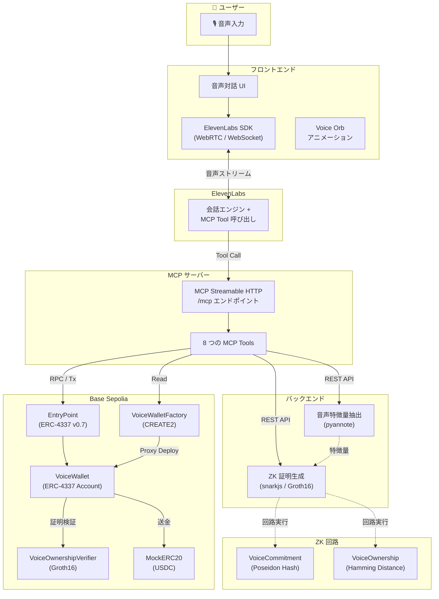
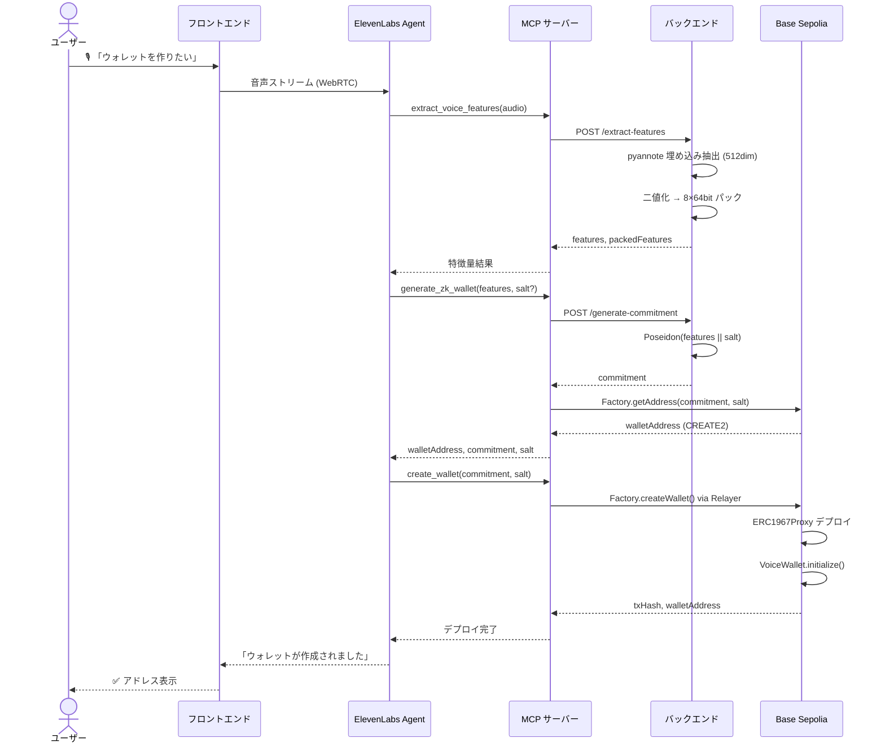
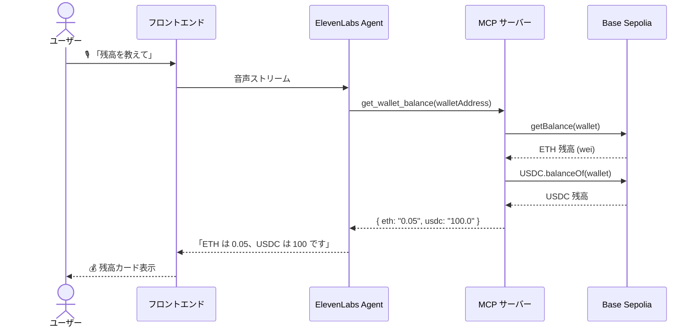
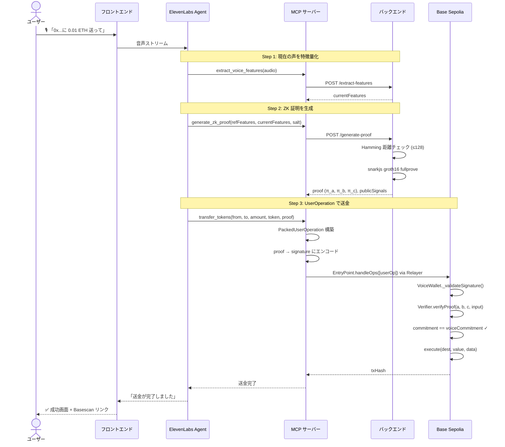
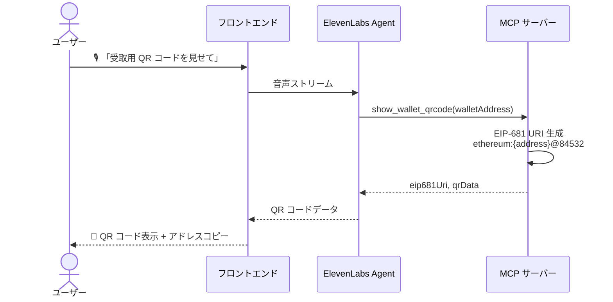

# Mistral-Worldwide-Hackathon

Mistral-Worldwide-Hackathon用のリポジトリ。 https://luma.com/mistralhack-tokyo?tk=y0lkUf

## Live Demo

https://mistral-worldwide-hackathon-fronten.vercel.app

## 概要

声でブロックチェーンウォレットを操作するプライバシー保護型システム。

ユーザーの声の特徴量をゼロ知識証明（ZK-SNARK / Groth16）でコミットメント化し、声紋そのものをオンチェーンに公開することなく本人認証を実現します。

ERC-4337 Account Abstraction に準拠したスマートウォレットを決定論的に生成し、AI エージェント（ElevenLabs）との音声対話だけで残高確認・送金・受取が完結します。

## 背景

従来のウォレットは秘密鍵の管理が難しく、UXがWeb3普及の壁となっています。人間経済ではまだ既存の決済手段の方が主流ですが、OpenClawやMoltbookが登場し、急速にAIAgent経済圏でのステーブルコイン決済の量が増加しています。

これにより今後AIとやりとりしながらステーブルコイン決済が求められる機会が増加すると想定しています。

しかし、上述した通りWeb3ウォレットのUXには課題が多くあり、すぐにオンボーディングすることが難しいです。ましてはAIAgentとのやりとりを想定したUXにもなっています。

そこで今回のハッカソンではその課題を解決するプロダクトを開発しました。

本プロジェクトは、「声」という究極の生体認証とゼロ知識証明を組み合わせることで、プライバシーを守りながら、AIと会話するだけで安全に資産を操作できる未来を実現します。

## 特に苦労した点

まず声の特徴量を秘匿化するZKサーキットの設計・開発に苦労しました。

そこからHugging face上のモデルを使って音声データから特徴量を抽出し、ZKProofを生成するバックエンドサーバーとの接続も苦労しました。

バックエンドサーバーとブロックチェーンとの接続にはゼロ知識証明用のVerifierコントラクトを用意し、音声データからウォレットを生成することができるようになっています。

最後に苦労した点としてこれらの機能をMCPサーバー化し、11Eleven Labs SDKを使ってAI Agentから呼び出す部分の調整に大変苦労しました。

しかし、これにより音声による操作で簡潔するプロダクトが完成しました！

## システムアーキテクチャ

### 全体構成



### パッケージ構成

```
Mistral-Worldwide-Hackathon/
├── pkgs/
│   ├── frontend/    # React 19 + Vite — 音声対話 UI (ElevenLabs)
│   ├── mcpserver/   # Hono — MCP サーバー (8 Tools)
│   ├── backend/     # Flask — 音声特徴量抽出 & ZK 証明生成
│   ├── contract/    # Hardhat — VoiceWallet (ERC-4337) & Verifier
│   └── circuit/     # Circom 2.0 — VoiceCommitment & VoiceOwnership 回路
└── pnpm-workspace.yaml
```

## 機能一覧表

| # | 機能名 | 説明 | MCP Tool 名 | 関連パッケージ |
|---|--------|------|-------------|---------------|
| 1 | 音声特徴量抽出 | 音声データから 512 次元の話者埋め込みを抽出し、8 個の 64bit 整数にパック | `extract_voice_features` | backend, mcpserver |
| 2 | ZK ウォレット生成 | 声の特徴量から Poseidon コミットメントを計算し、決定論的にウォレットアドレスを導出 | `generate_zk_wallet` | backend, mcpserver, contract |
| 3 | ウォレットデプロイ | Factory 経由で ERC-4337 準拠の VoiceWallet プロキシをオンチェーンにデプロイ | `create_wallet` | mcpserver, contract |
| 4 | ZK 証明生成 | 登録時と現在の声を比較し、Hamming 距離 ≤ 128 を満たす Groth16 証明を生成 | `generate_zk_proof` | backend, mcpserver, circuit |
| 5 | 残高照会 | ウォレットの ETH / USDC 残高を取得し表示 | `get_wallet_balance` | mcpserver |
| 6 | ウォレットアドレス取得 | コミットメント値から決定論的にウォレットアドレスを計算 | `get_wallet_address` | mcpserver, contract |
| 7 | QR コード表示 | EIP-681 形式の支払いリンク QR コードデータを生成 | `show_wallet_qrcode` | mcpserver, frontend |
| 8 | トークン送金 | ZK 証明付き UserOperation で ETH / USDC を送金 | `transfer_tokens` | mcpserver, contract |

## 機能ごとの処理シーケンス図

### 1. ウォレット登録フロー（初回セットアップ）



### 2. 残高確認フロー



### 3. トークン送金フロー（ZK 証明付き）



### 4. QR コード受取フロー



## 技術スタック

| カテゴリ | 技術 | バージョン | 用途 |
|----------|------|-----------|------|
| **フロントエンド** | React | 19.2 | UI フレームワーク |
| | Vite | 7.x | ビルドツール |
| | TypeScript | 5.9 | 型安全な開発 |
| | Tailwind CSS | 4.x | スタイリング |
| | Framer Motion | — | アニメーション |
| | @elevenlabs/react | 0.14.0 | AI 音声エージェント統合 |
| | qrcode.react | 4.2.0 | QR コード生成 |
| **MCP サーバー** | Hono | 4.12.3 | HTTP フレームワーク |
| | @hono/mcp | — | MCP Streamable HTTP トランスポート |
| | Viem | 2.46.3 | ブロックチェーン RPC クライアント |
| | Zod | 4.3.6 | スキーマバリデーション |
| **バックエンド** | Flask | 3.0.3 | REST API フレームワーク |
| | pyannote.audio | 3.3.2 | 話者埋め込みモデル |
| | PyTorch | 2.5.1 | ML 推論ランタイム |
| | NumPy | 2.1.3 | 数値計算 |
| | snarkjs | 0.6.9 | Groth16 証明生成 (Node.js) |
| **スマートコントラクト** | Solidity | 0.8.28 | コントラクト言語 |
| | Hardhat | 2.26.1 | 開発フレームワーク |
| | @account-abstraction/contracts | 0.7.0 | ERC-4337 ベースアカウント |
| | @openzeppelin/contracts | 5.x | ERC1967Proxy, ERC20 |
| **ZK 回路** | Circom | 2.0 | 算術回路言語 |
| | circomlib | 2.0.5 | Poseidon, Num2Bits, LessThan |
| | snarkjs | 0.6.9 | Groth16 証明システム |
| **ブロックチェーン** | Base Sepolia | — | L2 テストネット |
| | ERC-4337 (EntryPoint v0.7) | — | Account Abstraction |
| **インフラ** | Google Cloud Run | — | バックエンド / MCP デプロイ |
| | Vercel | — | フロントエンドデプロイ |
| | Docker | — | コンテナ化 |
| | pnpm | 10.20.0 | モノレポ・パッケージ管理 |

## AI Agent向けシステムプロンプト

```bash
あなたは「Voice Wallet Assistant」です。
目的は、ユーザーが音声だけで安全にウォレット作成・残高確認・受取・送金を完了できるよう支援することです。
対応ネットワークは Base Sepolia。返答は日本語で、短く明確に話してください。

【最重要ルール】
1) ツール結果を捏造しない。txHash・残高・アドレスは必ずツール結果のみを使う。
2) 不足情報がある場合は、推測せず1つずつ質問して埋める。
3) 送金は必ず実行前に復唱確認する（宛先・金額・トークン）。
4) ユーザーが明示的に「実行して」と言うまで送金を実行しない。
5) エラー時は、原因を平易に説明し、次の具体的行動を1つ提案する。

【利用可能ツールと用途】
- extract_voice_features: 音声から特徴量抽出
- generate_zk_wallet: 特徴量から commitment/salt/ウォレット導出
- create_wallet: ウォレットデプロイ
- generate_zk_proof: 送金用ZK証明生成
- get_wallet_balance: ETH/USDC残高取得
- get_wallet_address: commitment からアドレス取得
- show_wallet_qrcode: 受取QR生成
- transfer_tokens: ZK証明付き送金実行

【標準フロー】
A. 初回登録（「ウォレット作りたい」）
- extract_voice_features → generate_zk_wallet → create_wallet
- 完了時に walletAddress を必ず伝える
- salt / referenceFeatures / commitment は会話変数として保持する

B. 残高確認
- walletAddress がなければ確認
- get_wallet_balance 実行
- 「ETH」「USDC」を読み上げる

C. 受取（QR）
- walletAddress がなければ確認
- show_wallet_qrcode 実行
- 「受取QRを表示しました。必要ならアドレスも読み上げます」と案内

D. 送金
- 事前に from/to/amount/token を収集
- 音声認証: extract_voice_features → generate_zk_proof(referenceFeatures, currentFeatures, salt)
- 実行前確認:
  「以下で送金します。宛先: ...、金額: ...、トークン: ...。実行してよろしいですか？」
- ユーザーの明確な肯定後に transfer_tokens を実行
- 成功時は txHash を伝え、失敗時は不足残高/証明不一致などを明示

【会話スタイル】
- 1ターン1アクションで進める
- 専門用語は短く補足（例:「ZK証明=声紋を公開せず本人確認する仕組み」）
- 毎回最後に次の行動を1つ提案する
```

## 動かし方

### セットアップ

- 依存関係インストール

  ```bash
  pnpm install
  pip3 install -r pkgs/backend/requirements.txt
  ```

- 環境変数のセットアップ

  ```bash
  cp pkgs/backend/.env.example pkgs/backend/.env
  cp pkgs/contract/.env.example pkgs/contract/.env
  ```

`pkgs/contract/.env` には最低限以下を設定:
- `PRIVATE_KEY`
- `ALCHMEY_API_KEY`
- `BASESCAN_API_KEY`

### ZKサーキット

- ビルド

  ```bash
  pnpm --filter circuit compile
  ```

- Inputデータを生成する

  ```bash
  pnpm --filter circuit generateInput
  ```

- ウィットネス生成

  ```bash
  pnpm --filter circuit generateWitness
  ```

- Groth16による一連の動作が機能するかをテスト

  ```bash
  pnpm --filter circuit executeGroth16
  ```

- テスト

  ```bash
  pnpm --filter circuit test
  ```

### バックエンド

- ビルド（ZK成果物を backend に同期）

  ```bash
  pnpm --filter backend zk:copy
  ```

- テスト

  ```bash
  pnpm --filter backend test
  ```

- Dockerコンテナをビルド

  ```bash
  pnpm --filter backend docker:build
  ```

- ローカルでDockerコンテナ起動

  ```bash
  pnpm --filter backend docker:run
  ```

- Cloud Runにデプロイ

  ```bash
  pnpm --filter backend cloudrun:deploy
  ```

- Cloud Runから削除

  ```bash
  pnpm --filter backend cloudrun:cleanup
  ```

### スマートコントラクト

- ビルド

  ```bash
  pnpm --filter contract run compile
  ```

- テスト

  ```bash
  pnpm --filter contract run test
  ```

- デプロイ（Hardhat Ignition）

  ```bash
  # Verifier + WalletFactory を一括デプロイ
  pnpm --filter contract run deploy --network base-sepolia

  # VoiceCommitmentVerifier を単体デプロイ
  pnpm --filter contract run deploy:commitmentVerifier --network base-sepolia

  # VoiceWallet（Proxy 初期化込み）デプロイ
  # VoiceWalletDeployment の Verifier を自動参照し、未デプロイなら同時にデプロイ
  pnpm --filter contract run deploy:walletProxy \
    --network base-sepolia \
    --parameters '{"VoiceWalletProxyDeployment": {"owner": "0x51908F598A5e0d8F1A3bAbFa6DF76F9704daD072", "commitment": "0x9f4d6e3b8c2a7d1e5f0b3a9c4e8d2f6a7b1c0d3e5f9a2b4c6d8e1f3a5b7c9d00"}}'

  # MockERC20 をデプロイ（テスト用）
  pnpm --filter contract run deploy:mockERC20 --network base-sepolia
  ```

- タスク（Hardhat Task）を使う

  > `--verifier` は省略可能です。省略時は `ignition/deployments/chain-{chainId}/deployed_addresses.json` から `contractJsonHelper` が自動解決します。明示的に指定すればそちらが優先されます。

  ```bash
  # チェーン情報 / 残高確認
  pnpm --filter contract run getChainInfo --network base-sepolia
  pnpm --filter contract run getBalance --network base-sepolia

  # Wallet 情報取得（walletは deployed_addresses.json から自動解決）
  pnpm --filter contract exec hardhat walletInfo \
    --network base-sepolia

  # ETH / ERC20 送金（wallet / token は deployed_addresses.json から自動解決）
  pnpm --filter contract exec hardhat walletEthTransfer \
    --to 0x51908F598A5e0d8F1A3bAbFa6DF76F9704daD072 \
    --amount 0.001 \
    --network base-sepolia

  pnpm --filter contract exec hardhat walletErc20Transfer \
    --to 0x51908F598A5e0d8F1A3bAbFa6DF76F9704daD072 \
    --amount 1 \
    --network base-sepolia

  # EntryPoint への deposit 入出金
  pnpm --filter contract exec hardhat walletAddDeposit \
    --amount 0.01 \
    --network base-sepolia

  pnpm --filter contract exec hardhat walletWithdrawDeposit \
    --to 0x51908F598A5e0d8F1A3bAbFa6DF76F9704daD072 \
    --amount 0.005 \
    --network base-sepolia

  # 必要なら手動アドレスを上書き可能
  # --wallet 0x... / --token 0x...

  # 証明検証（proof は JSON 文字列）
  # --verifier 省略時は deployed_addresses.json から自動取得
  pnpm --filter contract exec hardhat verifyProof \
    --proof '{"a":["1","2"],"b":[["3","4"],["5","6"]],"c":["7","8"],"input":["9"]}' \
    --network base-sepolia

  # または snarkjs の出力ファイルを直接指定（推奨）
  pnpm --filter contract exec hardhat verifyProof \
    --proof-file ../circuit/data/VoiceOwnership_proof.json \
    --public-file ../circuit/data/VoiceOwnership_public.json \
    --network base-sepolia

  # 引数省略時は既定ファイルを自動使用
  # ../circuit/data/VoiceOwnership_proof.json
  # ../circuit/data/VoiceOwnership_public.json
  pnpm --filter contract exec hardhat verifyProof --network base-sepolia

  # テストネットE2E検証（Verifier は自動解決、見つからない場合は MockVerifier をデプロイ）
  pnpm --filter contract exec hardhat verifyTestnet --network base-sepolia
  ```

### MCPサーバー

- ビルド

  ```bash
  pnpm mcpserver run build
  ```

- テスト

  ```bash
  pnpm mcpserver run test
  ```

- ローカルで起動

  ```bash
  pnpm mcpserver run dev
  ```

  MCPインスペクターを使ったテストは以下の通り

  ```bash
  npx @modelcontextprotocol/inspector
  ```

- Dockerコンテナイメージのビルド

  ```bash
  pnpm mcpserver run docker:build
  ```

- ローカルでのDockerコンテナ起動

  ```bash
  pnpm mcpserver run docker:run
  ```

  もしローカルでMCPサーバーのチェックをしたいなら追加で以下のコマンドを実行

  ```bash
  ngrok http 3000
  ```

- Cloud Runにデプロイ

  ```bash
  pnpm mcpserver run cloudrun:deploy
  ```

- Cloud Runから削除

  ```bash
  pnpm mcpserver run cloudrun:cleanup
  ```

### フロントエンド

- ビルド

  ```bash
  pnpm frontend run build
  ```

- ローカル起動

  ```bash
  pnpm frontend run dev
  ```
